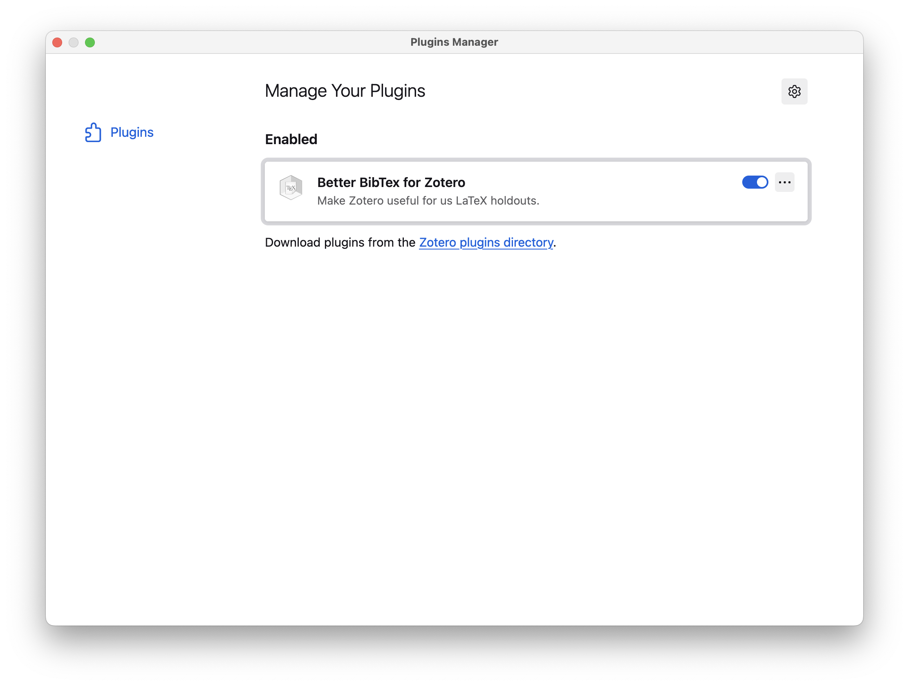
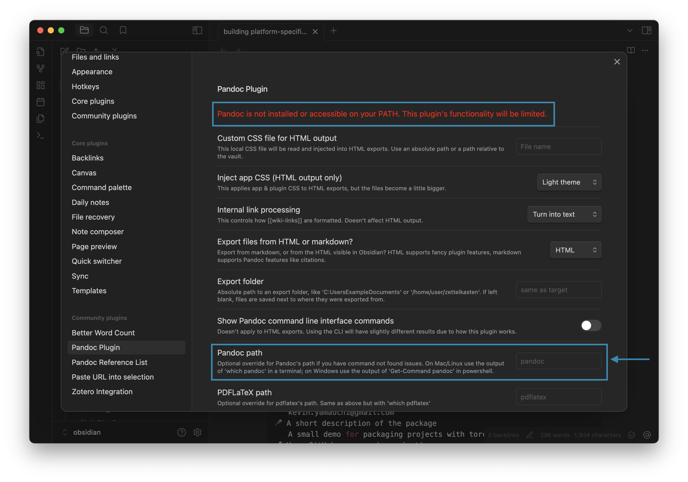
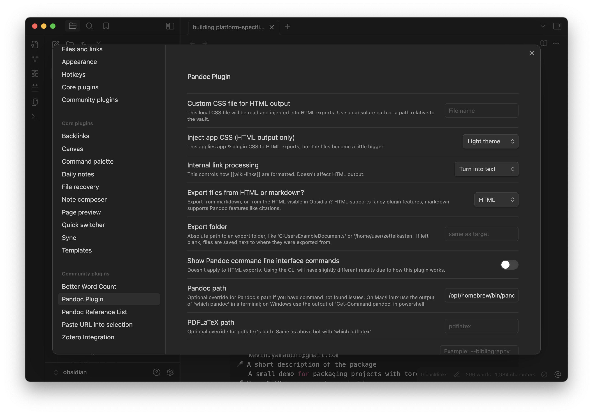
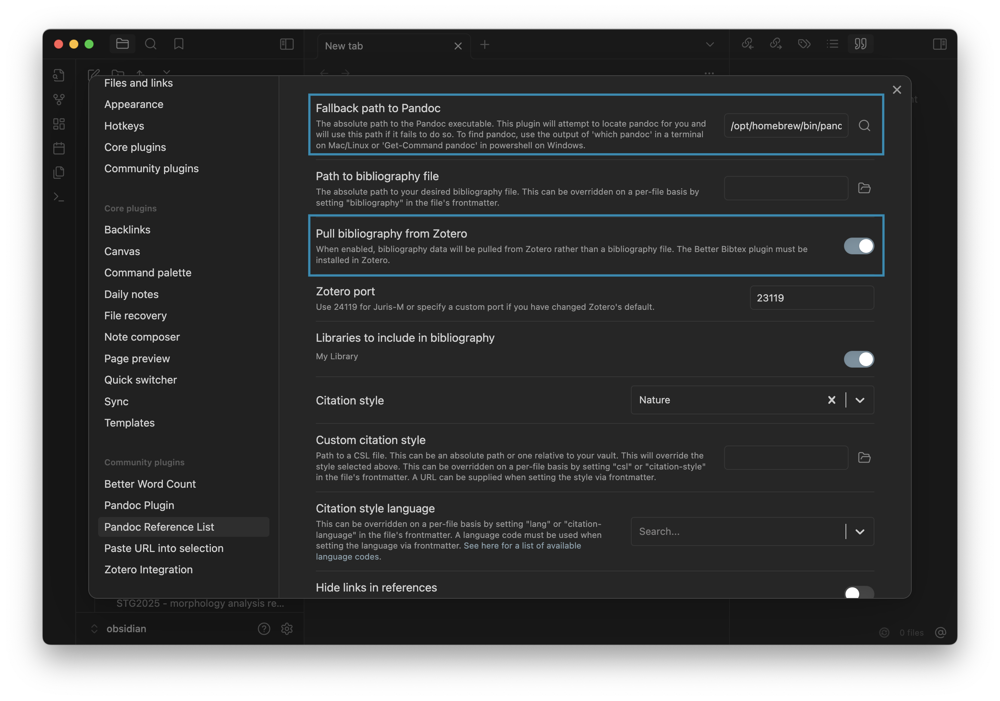
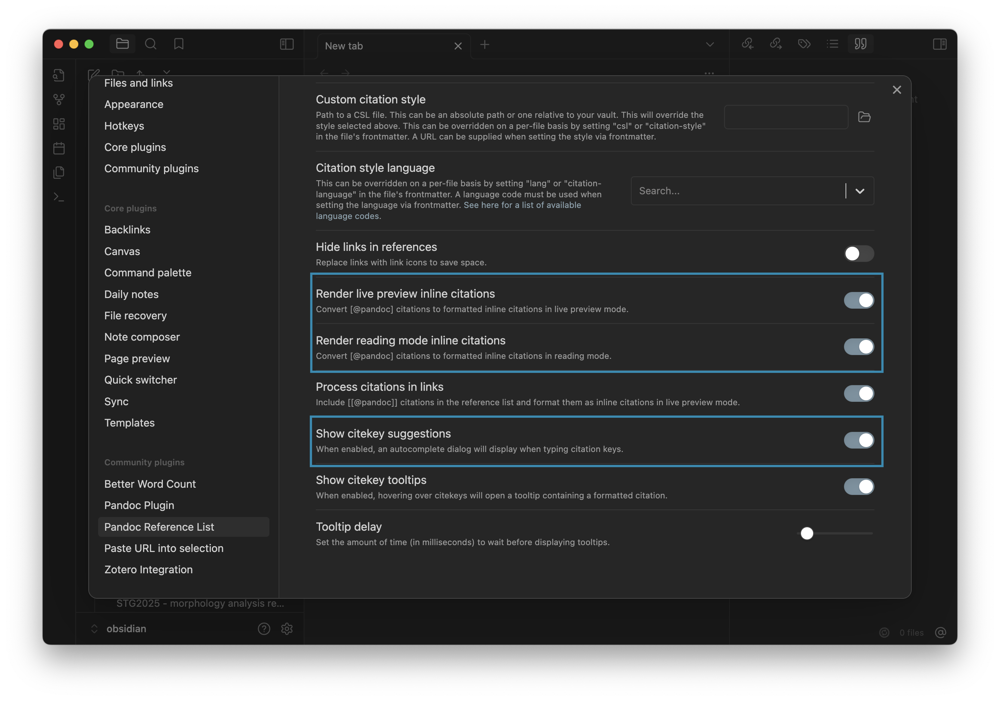
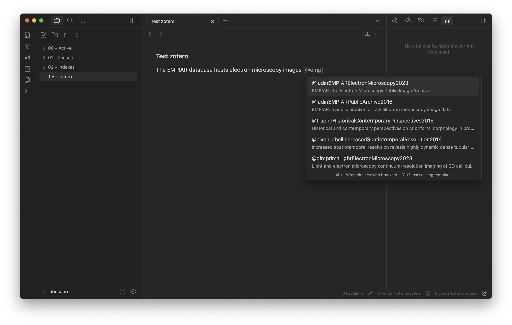
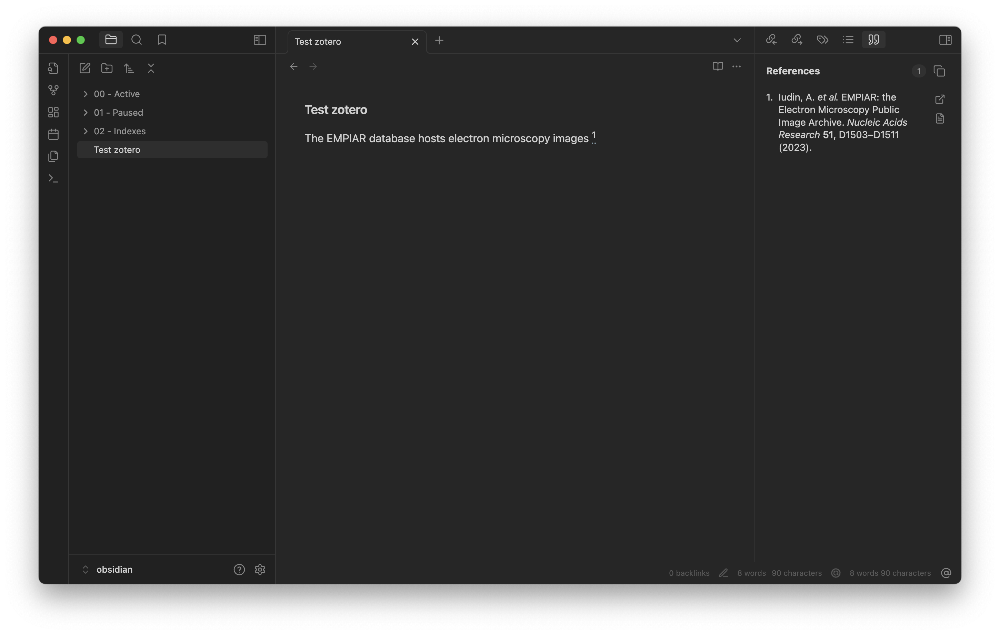

# Taking notes in Obsidian for research

I use [Obsidian](https://obsidian.md/) for taking digital notes for work. This post shows how I have set up Obsidian for my work as a scientist. My daily usage of Obsidian includes brainstorming, project planning, writing, and taking notes on papers (i.e., literature review).

<!-- more -->

## What do I use Obsidian for?

I use Obsidian to store text notes for work. The content of these notes ranges from ideas about projects to literature reviews. One thing I really like about Obsidian is that because it integrates nicely with my reference manager (Zotero), I can easily cite relevant work in my notes. This allows me to use Obsidian as a way to draft papers and proposals. I still use a pen and notebook for a lot of my brainstorming, doodling, etc. as I find it to be more free form than taking text notes in Obsidian. However, for purely text things, Obsidian has been great.

## Why Obsidian?

I have generally resisted using a digital note taking software because I was afraid of the risk of losing all of my notes if the service went out of business and of getting locked into a subscription service. Further, I wanted something that works well across Linux, Mac OS and iOS. Finally, I wanted a desktop app and not a web app that runs in the browser. I felt like like Obsidian addressed these concerns, so I gave it a try. I have been happy so far. These are my main reasons to continue using Obsidian:

- The notes are just Markdown files in folders. This means that I will be able to continue using the notes without the Obsidian app.
- Obsidian works well offline. I like to work offline to avoid distractions, so I didn't want something that requires a persistant network connection.
- Integrating Obsidian with Zotero, my reference management software of choice, allows me to write notes with citations.
- The app works nicely across Linux, Mac OS, and iOS. The paid Sync service has worked seamlessly for me so far.

## How I use Obsidian

There are a ton of tutorials on how to use Obsidian available on the internet. Many of which describe intriguing but super complicated systems where taking notes becomes a project in and of it self. I am simple and I more-or-less just treat it as a collection of searchable text files. Obsidian has the ability to create links between notes and visualize your note collection (vault in Obsidian parlance) as a graph. I personally don't find this super useful and the overhead of remembering to link notes to be too much. The only linking that I do is back to Index notes that serve as a hub for a collection of related notes (e.g., for a specific project). My "system" is as follows:

In my Obsidian vault, I have three folders:

- Active: these are the notes I am currently working on.
- Paused: these are the notes I am not currently working on.
- Indexes: here I put notes that serve as indexes for categories of notes. For example, each project I am working gets an "index" note. I will describe how they are used below.

My workflow is as follows:

1. Create a new note in the Active folder.
2. Add a link to any of the Index notes that are relevant. If necessary, I create a new Index note.
3. Write.
4. When I am "done" with the note, I move it to the Paused folder. Note that, "done" in this context just means that I am not actively working on it. If I need to add more or revise it later, I just move the note back to the Active folder.

## Plugins
Obsidian has a huge [plugin ecosystem](https://obsidian.md/plugins). I haven't explored most of them, but here are the ones I find useful:

- [Paste URL into selection](https://github.com/denolehov/obsidian-url-into-selection): when I have some text highlighted, I can paste a link (cmd + v) and it will automatically turn that text into a hyperlink.
- References integration: these plugins work together to allow me to add citations to notes using my Zotero library (see "Zotero integration" section below.)
    - [Pandoc Plugin](https://github.com/OliverBalfour/obsidian-pandoc)
    - [Pandoc Reference List](https://github.com/mgmeyers/obsidian-pandoc-reference-list)
    - [Zotero Integration](https://github.com/mgmeyers/obsidian-zotero-integration)


## Zotero integration
I like keeping notes on papers I read in Obsidian. For all of my academic work, I use [Zotero](https://www.zotero.org/) to manage my references (i.e., papers). Below I describe how I have set up Obsidian so that I can cite papers from my Zotero library and render a bibliography.

This is basically a simplified version of the [workflow from Alexandra Phelan](https://medium.com/@alexandraphelan/an-updated-academic-workflow-zotero-obsidian-cffef080addd). I would recommend checking out their guide for a more full-featured workflow.

### Setting up Zotero
The Zotero plugin for Obsidian requires you to have the [Better Bibtex for Zotero](https://retorque.re/zotero-better-bibtex/) installed in your Zotero Desktop application. In order to install the Better Bibtex for Zotero plugin, see their [instructions](https://retorque.re/zotero-better-bibtex/installation/index.html). Once installed, you should see it listed under your plugins with the activation toggle switched "on".



Depending on your version of Zotero, you may need to restart Zotero in order for the plugin to work properly.

### Installing pandoc
The integration I use requires [pandoc](https://pandoc.org/). You can check out their [installation guide](https://pandoc.org/) for instructions on how to install pandoc on your system.

On Mac OS, I use `brew`:

```bash
brew install pandoc
```

You can confirm `pandoc` is installed by typing the following command in your terminal

```bash
pandoc --version
```
which should return the version of `pandoc` that is installed.

### Setting up Obsidian

First, install the following community plugins:

- [Pandoc Plugin](https://github.com/OliverBalfour/obsidian-pandoc)
- [Pandoc Reference List](https://github.com/mgmeyers/obsidian-pandoc-reference-list)
- [Zotero Integration](https://github.com/mgmeyers/obsidian-zotero-integration)

#### Configure Pandoc plugin

Open the preferences for the Pandoc plugin (Settings -> Community Plugins -> Pandoc Plugin). You may see that the plugin says that it cannot find `pandoc` on the Path (see the red text at the top of the preferences pane).



You can get the path to `pandoc` by typing the following command in your terminal, which will return the path to your `pandoc` installation.

```bash
which pandoc
```

Copy the path that is returned from the above command. You can then tell the Pandoc plugin where to find `pandoc` by pasting the path in the "Pandoc path" field of the preferences. After doing so, restart Obsidian and check the preferences again. You should see that the error message about being unable to find `pandoc` should no longer be present.




#### Configure Pandoc Reference List

Open the preferences for the Pandoc Reference List plugin (Settings -> Community Plugins -> Pandoc Reference List) and do the following:

1. Check that the path to `pandoc` is correct. This should match the path you set in the Pandoc Plugin configuration above.
2. Make Zotero the source for the citations by turning on the "Pull bibliography from Zotero" option.
3. Ensure that the following options turned on.

    1. Render live preview inline citations: This will convert the cite keys to reference numbers while you are editing.
    2. Render reading mode inline citations: his will convert the cite keys to reference numbers while you are in reading mode.
    3. Show cite key suggestions: This will suggest cite keys as you make citations in the markdown.





### Make inline citations in an Obsidian note

Now that you have the plugins set up, you can make inline citations in your Obsidian notes! To do so, simply enter `[@` where you would like to place the citation and start typing the cite key of the item you would like to cite. This will bring up a box you can search your zotero library for the relevant citation.



You can select the citation of interest by using the up/down arrow keys and pressing enter. Once you have done so, the associated reference will show up in the references pane on the right.

