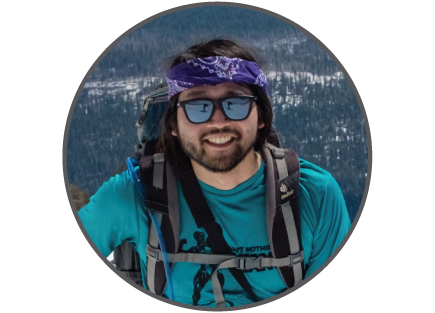

#

- 

- ## About me
  Currently, I am a postdoctoral researcher, advised by Dagmar Iber in the Department of Biosystems Science and Engineering at the ETH Zürich where I study how physics shapes and constrains biological systems. Towards this, I am combining computer vision and physics-based simulation to connect morphology to the mechanical properties of cells and tissues. Additionally, I am a steering council member and core developer of [napari](https://github.com/napari/napari).
  
    Outside of the lab, you can find me skiing and climbing.

